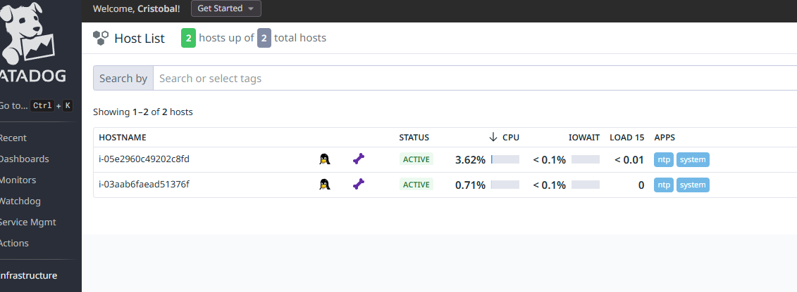
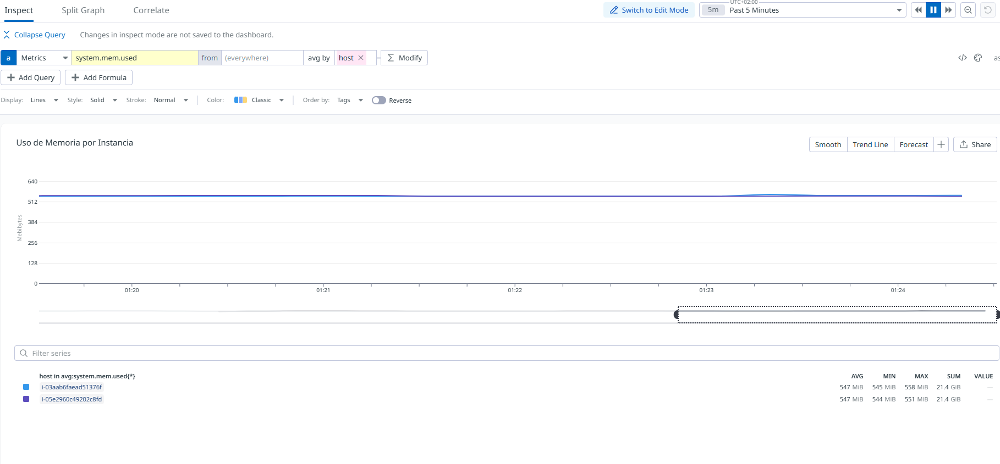
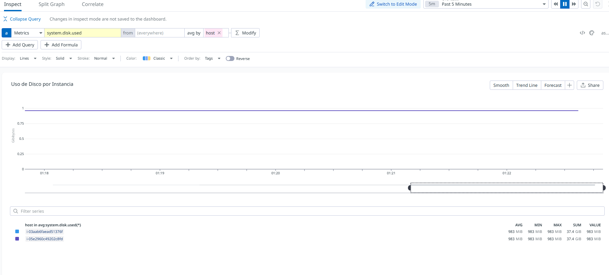

O. Se añade la documentacion de los recursos útiles a la documentacion de Cursor.

1. Para obtener las keys de AWS se crea un usuario IAM terraform y se obitnene las claves para ese usuario siguiendo las buenas practicas

2. Se generan las api key y app key en datadog.

3. El archivo terraform.tfvars se añade a gitignore para que las keys no se publiquen con el código

4. Se analiza los elementos de AWS que se van a generar, se cambia la instancia para el frontend de t1.medioum a t1.micro. La t1.medium tenia coste adicional, se salia de la capa gratuita. El resto de elementos se mantenian sin sobrecostes.

4. Se comenta la parte de los tags de datadog en del archivo datadog_dashboard.tf poruqe daban errores al generar el terraform

5. En datadog_dashboard.tf se cambia layout_type de ordered a free, sino daba un error con los dashboards y no generaba el terraform

6. en la configuracion del archivo /etc/datadog-agent/datadog.yaml del agente en las instancias, el site salia como datadoghq.com por eso no comunicaba ni mostraba la telemetria. Al cambiarlo a datadoghq.eu ya empezó a funcionar

# Documentación de Infraestructura

## Diagramas y Gráficos

### Infraestructura General

*Diagrama general de la infraestructura mostrando la arquitectura del sistema*

### Monitoreo de Recursos

*Gráfico mostrando el uso de memoria para cada instancia EC2*

*Gráfico mostrando el uso de disco para cada instancia EC2*